# 💼 Personal Portfolio Website

> A clean, modern, and responsive portfolio website to showcase your skills, projects, and professional journey.


## 🎯 What is this?

This is a **personal portfolio website** that helps you:
- Show your work to potential employers
- Display your coding skills
- Share your contact information
- Present your projects in a professional way

Think of it as your **digital business card** that never gets lost!

## ✨ What's Inside?

```mermaid
graph TD
    A[🏠 Home Page] --> B[👨‍💻 About Me]
    A --> C[🛠️ Skills]
    A --> D[📁 Projects]
    A --> E[📞 Contact]
    
    B --> F[📄 Resume Download]
    D --> G[🔗 Live Demos]
    D --> H[📱 GitHub Links]
    E --> I[📧 Email Form]
    E --> J[🔗 Social Media]
    
    style A fill:#4a90e2,stroke:#333,stroke-width:2px,color:#fff
    style B fill:#50c878,stroke:#333,stroke-width:2px,color:#fff
    style C fill:#ff6b6b,stroke:#333,stroke-width:2px,color:#fff
    style D fill:#ffd93d,stroke:#333,stroke-width:2px,color:#000
    style E fill:#ff8c42,stroke:#333,stroke-width:2px,color:#fff
```



## 🚀 How to Use This (Super Easy!)

### Step 1: Get the Code
```bash
# Copy this repository to your computer
git clone https://github.com/shahdhairya12/Portfolio.git

# Go into the folder
cd Portfolio
```

### Step 2: Open It
- Just double-click on `index.html`
- Or open it with any web browser
- That's it! 🎉

### Step 3: Make It Yours
- Replace the placeholder text with your information
- Add your own photos
- Update the projects section
- Change colors if you want

## 📁 What Files Do What?

```mermaid
graph LR
    A[📁 Portfolio Folder] --> B[🌐 index.html<br/>Main webpage]
    A --> C[🎨 style.css<br/>Makes it pretty]
    A --> D[⚡ script.js<br/>Makes it interactive]
    A --> E[📸 images/<br/>Your photos]
    A --> F[📄 assets/<br/>Resume & docs]
    
    style A fill:#e1f5fe,stroke:#0277bd,stroke-width:2px
    style B fill:#f3e5f5,stroke:#7b1fa2,stroke-width:2px
    style C fill:#e8f5e8,stroke:#388e3c,stroke-width:2px
    style D fill:#fff3e0,stroke:#f57c00,stroke-width:2px
    style E fill:#fce4ec,stroke:#c2185b,stroke-width:2px
    style F fill:#f1f8e9,stroke:#689f38,stroke-width:2px
```



## 🎨 Easy Customization Guide

### Change Your Information
1. **Open `index.html`** in any text editor
2. **Find these sections** and replace with your info:
   ```html
   <h1>Your Name Here</h1>
   <p>Your job title here</p>
   <p>Write about yourself here</p>
   ```

### Add Your Projects
1. **Find the projects section**
2. **Copy this template** for each project:
   ```html
   <div class="project">
       
       <h3>Project Name</h3>
       <p>What does this project do?</p>
       <a href="your-github-link">View Code</a>
       <a href="your-live-demo">Live Demo</a>
   </div>
   ```

### Change Colors
1. **Open `style.css`**
2. **Find this section** at the top:
   ```css
   :root {
       --main-color: #4a90e2;     /* Change this to your favorite color */
       --text-color: #333;        /* Text color */
       --background: #ffffff;      /* Background color */
   }
   ```

## 🌐 Put It Online (Free!)

### Option 1: GitHub Pages (Recommended)
1. Go to your repository on GitHub
2. Click "Settings"
3. Scroll down to "Pages"
4. Select "Deploy from a branch"
5. Choose "main" branch
6. Click "Save"
7. **Your website is now live!** 🎉

### Option 2: Netlify
1. Go to [netlify.com](https://netlify.com)
2. Drag and drop your portfolio folder
3. **Done!** Your site is live

## 📱 Works on Everything

Your portfolio will look great on:
- 💻 Desktop computers
- 📱 Mobile phones
- 📟 Tablets
- 🖥️ Large screens

## 🆘 Need Help?

### Common Issues:

**🤔 Images not showing?**
- Make sure image files are in the `images/` folder
- Check that file names match exactly (case-sensitive!)

**🤔 Colors look weird?**
- Check your CSS file for typos
- Make sure color codes start with `#`

**🤔 Site not loading online?**
- Wait 5-10 minutes after deployment
- Check that `index.html` is in the main folder

### Get Help:
- 📧 Create an issue on GitHub
- 💬 Ask on Stack Overflow
- 📖 Check online tutorials

## 🎯 Make It Better

### Easy Additions:
- [ ] Add a dark mode toggle
- [ ] Include a contact form
- [ ] Add animations
- [ ] Create a blog section
- [ ] Add testimonials

### Advanced Features:
- [ ] Connect to a database
- [ ] Add a content management system
- [ ] Include analytics
- [ ] Add search functionality

## 🏆 Showcase Your Work

### Before You Share:
1. ✅ Test on different devices
2. ✅ Check all links work
3. ✅ Proofread all text
4. ✅ Optimize images for web
5. ✅ Add your contact information

### Share Your Portfolio:
- 📧 Include in job applications
- 💼 Add to LinkedIn profile
- 📱 Share on social media
- 🎯 Include in your email signature

## 📞 Contact & Support

If you need help or have questions:

- **Email**: your.email@example.com
- **GitHub**: [@shahdhairya12](https://github.com/shahdhairya12)
- **LinkedIn**: [Your LinkedIn Profile](https://linkedin.com/in/yourprofile)

## 🙏 Credits

- **Icons**: Font Awesome
- **Fonts**: Google Fonts
- **Inspiration**: Modern web design trends
- **You**: For making it awesome! 🌟

## 📜 License

Feel free to use this template for your own portfolio! 

---

### 🎉 Ready to Get Started?

1. **Download** or clone this repository
2. **Customize** it with your information
3. **Deploy** it online
4. **Share** your awesome portfolio!

**⭐ Don't forget to star this repository if it helped you!**

---

*Made with ❤️ and lots of ☕*
